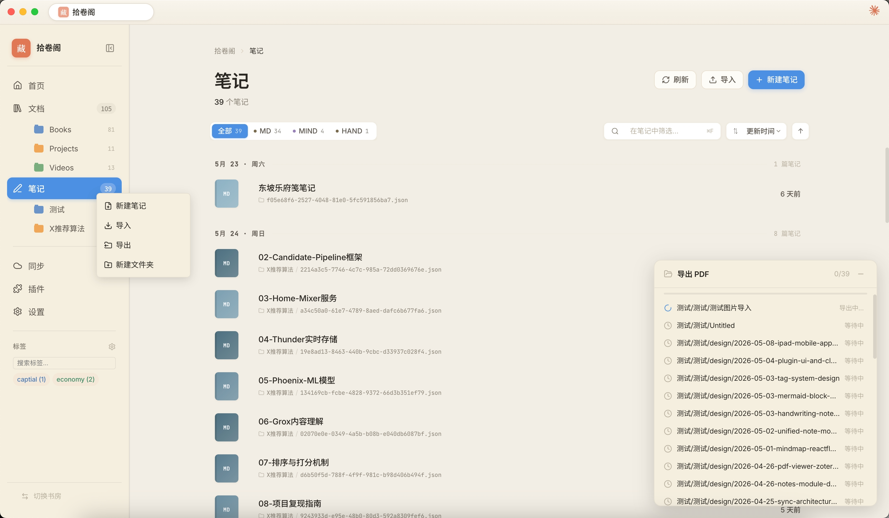
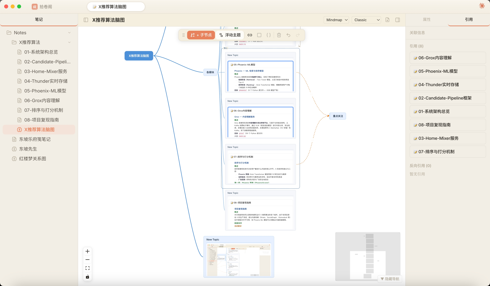
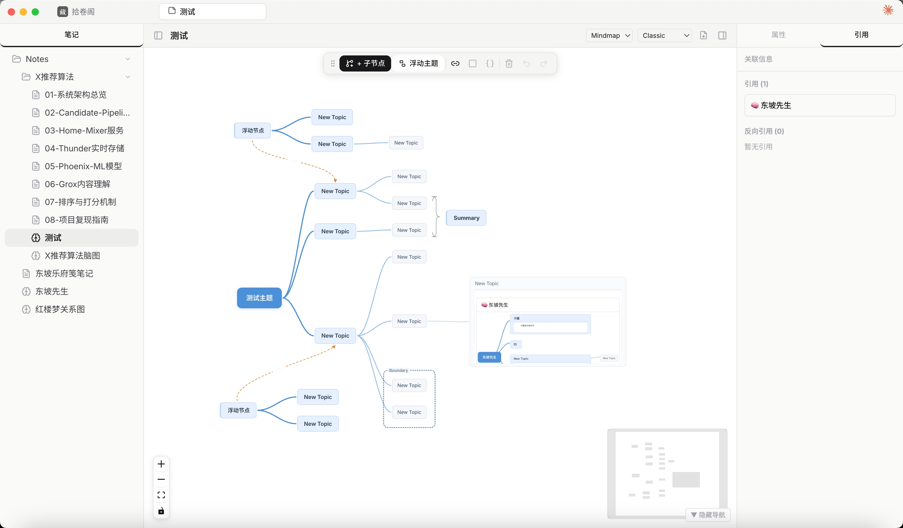
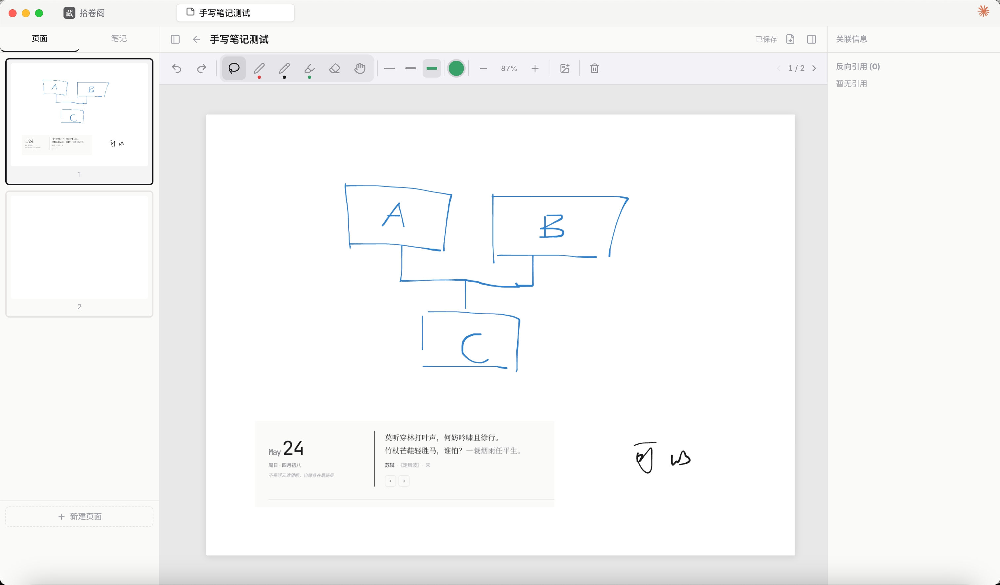
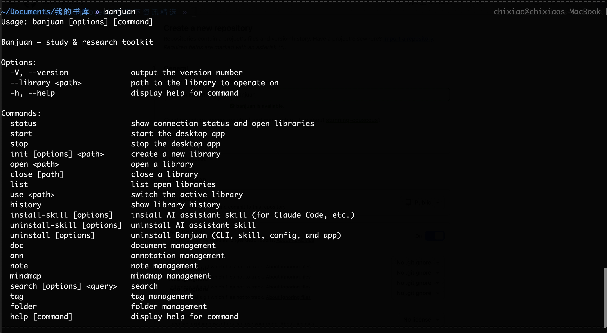

<p align="center">
  
</p>

<h1 align="center">Banjuan (半卷)</h1>

<p align="center">
  <strong>Read wisely, live fully.</strong><br>
  All-in-one study & research tool — document management, reading annotations, note-taking, mind maps
</p>

<p align="center">
  <a href="README.md">中文</a> ·
  <a href="#features">Features</a> ·
  <a href="#screenshots">Screenshots</a> ·
  <a href="#installation">Installation</a> ·
  <a href="#cli">CLI</a> ·
  <a href="#development">Development</a> ·
  <a href="#architecture">Architecture</a> ·
  <a href="#contributing">Contributing</a> ·
  <a href="https://htmlpreview.github.io/?https://github.com/chixiaowll/banjuan/blob/main/docs/milestone/milestone.html">Milestones</a>
</p>

---

Banjuan is an open-source, cross-platform study and research tool that combines document management (like Zotero), reading annotations (like MarginNote), Markdown notes (like Obsidian), and handwriting notes (like GoodNotes) into a single app. All data is stored locally, with optional WebDAV sync across devices.

## Screenshots

### Welcome & Home

<p align="center">
  
</p>
<p align="center"><em>Welcome — daily poem, lunar date, recently opened libraries</em></p>

<p align="center">
  
</p>
<p align="center"><em>Library home — document stats, daily reading, recent documents</em></p>

### Document Library

<p align="center">
  
</p>
<p align="center"><em>Document management — folder tree, type filter, search, sorting</em></p>

### PDF Reading & Annotation

<p align="center">
  
</p>
<p align="center"><em>PDF reader — handwriting annotations + note panel (Markdown, mind map, handwriting)</em></p>

### Notes

<p align="center">
  
</p>
<p align="center"><em>Notes — organized by folder, filtered by type</em></p>

<p align="center">
  
</p>
<p align="center"><em>Markdown note — outline navigation, linked references, rich text editing</em></p>

<p align="center">
  
</p>
<p align="center"><em>Batch export — runs in a background process (never blocks browsing); the progress panel accumulates like a download list</em></p>

### Mind Map

<p align="center">
  
</p>
<p align="center"><em>Mind map — embedded note content, backlink reference panel</em></p>

<p align="center">
  
</p>
<p align="center"><em>Mind map — floating nodes, boundary boxes, summary brackets, relation edges</em></p>

### Video Playback

<p align="center">
  
</p>
<p align="center"><em>Video playback — keyframe capture, keyframe navigation, note-taking</em></p>

### Handwriting

<p align="center">
  
</p>
<p align="center"><em>Handwriting note — multi-page, pressure-sensitive ink, multiple brushes and colors</em></p>

### AI Integration

<p align="center">
  
</p>
<p align="center"><em>Claude assistant — read and discuss a PDF in place, aware of the current page; reads document text by page/chapter</em></p>

<p align="center">
  
</p>
<p align="center"><em>Claude plugin — AI assistant with direct access to library content (search, notes, mindmaps, tags, ...)</em></p>

<p align="center">
  
</p>
<p align="center"><em>CLI — full-featured command-line tool for managing libraries, documents, notes, and tags</em></p>

<p align="center">
  
</p>
<p align="center"><em>CLI + AI — batch note operations via command line, seamless LLM integration</em></p>

## Features

### Document Library

- Import and manage PDF, EPUB, Markdown, TXT, HTML, images, video, and more
- Tag system (with colors) and folder organization
- Chrome extension for saving web content (right-click context menu)
- Unsupported file types automatically open with system default app

### Reading & Annotation

- **PDF Reader** — table of contents navigation, page thumbnails
- **EPUB Reader** — chapter navigation, font size adjustment
- **Markdown Reader** — beautiful rendering with BlockNote, chapter outline
- **Annotation Tools** — text highlight (7 colors), area selection, text comments
- **Handwriting Annotations** — pressure-sensitive ink, eraser, lasso select & move, grouped by chapter
- **Reading Timer** — automatic reading time tracking per document

### Note-Taking

- **Markdown Notes** — rich text editor powered by BlockNote, code highlighting, Mermaid diagrams
- **Handwriting Notes** — multiple paper templates (blank, lined, grid, dot, Cornell)
- **Mind Maps** — node editing with React Flow, auto-layout, floating topics, boundary boxes, summary brackets, relation edges
- Document-linked notes, bidirectional links (`[[]]` / `![[]]`), backlink panel

### AI Integration

- **Built-in Claude assistant** — a sidebar AI panel (powered by local Claude Code) that reads document text (PDF/EPUB/txt/md/html, by page/chapter), notes and annotations; creates/edits notes and mindmaps; tags and organizes folders; searches the web; and can delete (with confirmation)
- **Live tool trace** — thinking and tool calls (inputs/results) shown step by step and kept after completion
- **Context-aware** — knows the current library, open documents/notes, current page and its text, and selected text
- **Global plugin** — built-in plugins install to `~/.banjuan/plugins` and apply to every library; the plugin framework supports commands, events, RPC, and MCP tools
- **CLI** — LLM-friendly command-line interface, can be used directly in tools like Claude Code

### Sync

- WebDAV sync (compatible with Nutstore and similar services)
- Local-first architecture, works offline

### Cross-Platform

- macOS / Windows / Linux desktop (Electron)
- iPad / iPhone mobile (Capacitor)
- CLI command-line tool

## Installation

### Desktop

Download the installer for your platform from [Releases](../../releases):

| Platform | Format |
|----------|--------|
| macOS (Apple Silicon) | `.dmg` / `.zip` |
| Windows | `.exe` (NSIS installer) |
| Linux | `.AppImage` |

### From Source

```bash
# Prerequisites
Node.js >= 20
pnpm

# Clone
git clone https://github.com/chixiaowll/banjuan.git
cd banjuan

# Install dependencies
pnpm install

# Start dev mode
pnpm dev
```

## CLI

After installing the desktop app, the `banjuan` command is automatically added to system PATH. The CLI connects to the running desktop app via HTTP — no separate database setup needed.

### Prerequisites

- Desktop app is running
- A library is open in the app

### Commands

```bash
# Library management
banjuan status                       # Check connection status
banjuan init <path> --name "My Lib"  # Create new library
banjuan open <path>                  # Open a library
banjuan close                        # Close current library
banjuan list                         # List open libraries
banjuan use <path>                   # Switch active library
banjuan history                      # Library history

# Notes
banjuan note list                    # List all notes
banjuan note list --doc <doc-id>     # List notes linked to a document
banjuan note show <id>               # Show note content
banjuan note create <title>          # Create an empty note
banjuan note create <title> --content "# md"  # Create with markdown content
banjuan note create <title> --file note.md    # Create from a file (local images imported)
banjuan note create <title> < note.md         # Create from stdin
banjuan note update <id> --title "New Title"  # Update note title
banjuan note update <id> --content "content"  # Update note content
banjuan note move <id> <folder>      # Move note to folder
banjuan note delete <id>             # Delete a note

# Documents
banjuan doc list                     # List all documents
banjuan doc import <file>            # Import a document
banjuan doc info <id>                # Show document details
banjuan doc delete <id>              # Delete a document

# Search
banjuan search "keyword"             # Search
banjuan search "keyword" --type note # Filter by type (document/note/annotation)

# Annotations
banjuan ann list <doc-id>            # List document annotations
banjuan ann list <doc-id> --page 5   # Filter by page

# Mind Maps
banjuan mindmap list                 # List all mind maps
banjuan mindmap show <id>            # Show mind map structure (tree view)
banjuan mindmap create <title>       # Create a mind map
banjuan mindmap add-node <id> <title> --parent <node-id>  # Add node
banjuan mindmap update-node <node-id> --title "New Title" # Update node
banjuan mindmap remove-node <node-id>                     # Remove node

# Tags
banjuan tag list                     # List all tags
banjuan tag assign <id> note "important"   # Add tag to note
banjuan tag unassign <id> note "important" # Remove tag

# Folders
banjuan folder list --type notes     # List note folders
banjuan folder create <name> --type notes  # Create folder
```

All list commands support `--json` flag for JSON output, useful for scripting and AI tool integration.

### Using with AI Tools

The CLI is designed to be LLM-friendly. In AI coding tools like Claude Code, call it directly via Bash:

```bash
# Search notes
banjuan search "machine learning" --json

# Read note details
banjuan note show <id> --json

# Batch write note content
banjuan note update <id> --content "$(cat notes.md)"
```

## Development

### Project Structure

```
banjuan/
├── packages/
│   ├── core/                 # Core library — database, documents, annotations, notes, sync
│   ├── app/                  # Electron desktop app
│   ├── shared-ui/            # Shared React UI components
│   ├── mobile/               # Capacitor iOS/iPad app
│   ├── platform-node/        # Node.js platform abstraction (SQLite, filesystem)
│   ├── platform-capacitor/   # Capacitor platform abstraction
│   ├── cli/                  # Command-line tool
│   ├── chrome-extension/     # Chrome extension
│   └── zotero-pdfjs-dist/    # Custom PDF.js build
└── docs/                     # Design docs
```

### Commands

```bash
# Start desktop app (dev mode)
pnpm dev

# Build all packages
pnpm build

# Run tests
pnpm test

# Package desktop app
cd packages/app && pnpm dist

# Start mobile dev
cd packages/mobile && pnpm dev

# Sync iOS project
cd packages/mobile && npx cap sync ios && npx cap open ios
```

### Tech Stack

| Layer | Technology |
|-------|-----------|
| Desktop | Electron 35 |
| Mobile | Capacitor 6 |
| Frontend | React 19 + TypeScript 5.7 |
| Build | Vite 6 |
| Database | better-sqlite3 (desktop) / sql.js (mobile) |
| Rich Text | BlockNote + Mantine |
| PDF | PDF.js (Zotero variant) |
| EPUB | epub.js |
| Handwriting | perfect-freehand + Canvas API |
| Mindmap | React Flow (@xyflow/react) |
| Sync | WebDAV |

## Architecture

```
┌──────────────────────────────────────────────────────┐
│                    Applications                       │
│                                                       │
│  ┌──────────┐  ┌──────────┐      ┌───────────────┐   │
│  │ Electron │  │ Capacitor│      │     CLI       │   │
│  │   App    │  │  Mobile  │      │  (banjuan)    │   │
│  └────┬─────┘  └────┬─────┘      └───────┬───────┘   │
│       │              │                    │           │
│       │              │              HTTP API          │
│       │              │             (localhost)        │
│       │              │                    │           │
│  ┌────┴──────────────┴────┐        ┌──────┴───────┐   │
│  │      shared-ui         │        │  API Server  │   │
│  │  (React Components)    │        │  (Electron)  │   │
│  └────────────┬───────────┘        └──────┬───────┘   │
│               │                           │           │
│  ┌────────────┴───────────────────────────┴──────┐   │
│  │              @banjuan/core                    │   │
│  │  (Library, Documents, Annotations,            │   │
│  │   Notes, Mindmaps, Tags, Search)              │   │
│  └────────────┬──────────────────────────────────┘   │
│               │                                       │
│  ┌────────────┴──────────────────────────────────┐   │
│  │        Platform Abstraction                   │   │
│  │  ┌─────────────┐  ┌─────────────────┐        │   │
│  │  │platform-node│  │platform-capacitor│        │   │
│  │  │  (SQLite,   │  │   (sql.js,      │        │   │
│  │  │  node:fs)   │  │  Capacitor FS)  │        │   │
│  │  └─────────────┘  └─────────────────┘        │   │
│  └───────────────────────────────────────────────┘   │
└──────────────────────────────────────────────────────┘
```

Core design principles:

- **Local-first** — all data stored in local filesystem and SQLite database
- **Platform abstraction** — `@banjuan/core` abstracts filesystem and database operations; desktop and mobile provide their own implementations
- **Shared UI** — `shared-ui` contains all React components, shared between desktop and mobile
- **Offline-capable** — no cloud dependency, WebDAV sync is optional

## i18n

Supports 7 languages: Chinese, English, Japanese, Korean, French, German, Spanish. Switch in settings. Contributions for additional languages are welcome.

Translation files are in `packages/shared-ui/src/i18n/`.

## Contributing

Contributions are welcome! Please discuss new features or bugs via Issues, then submit a Pull Request.

```bash
# Fork & Clone
git clone https://github.com/<your-username>/banjuan.git

# Create branch
git checkout -b feat/your-feature

# Dev & test
pnpm dev
pnpm test

# Submit PR
```

## License

MIT
