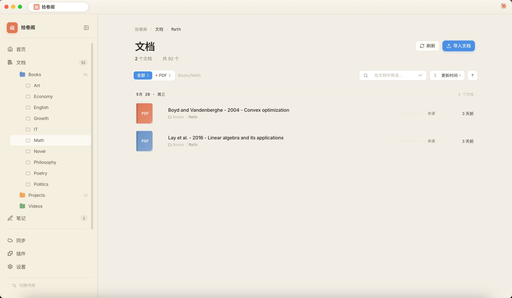
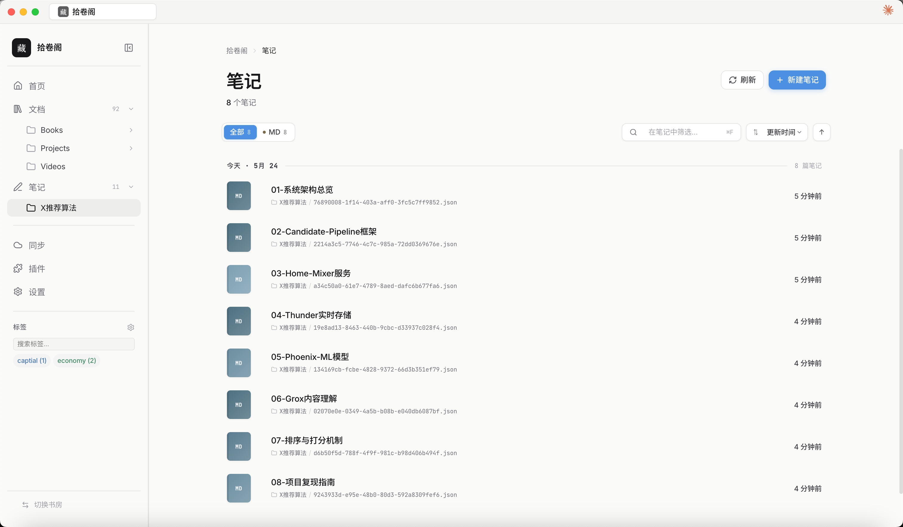
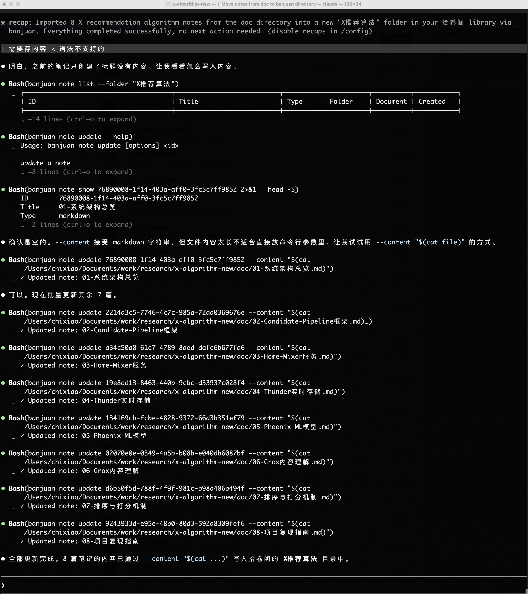

<p align="center">
  
</p>

<h1 align="center">半卷 (Banjuan)</h1>

<p align="center">
  <strong>Read wisely, live fully.</strong><br>
  一站式学习与研究工具 — 文献管理、阅读标注、笔记写作、知识图谱
</p>

<p align="center">
  <a href="README-en.md">English</a> ·
  <a href="#features">Features</a> ·
  <a href="#screenshots">Screenshots</a> ·
  <a href="#installation">Installation</a> ·
  <a href="#cli">CLI</a> ·
  <a href="#development">Development</a> ·
  <a href="#architecture">Architecture</a> ·
  <a href="#contributing">Contributing</a> ·
  <a href="https://htmlpreview.github.io/?https://github.com/chixiaowll/banjuan/blob/main/docs/milestone/milestone-zh.html">开发里程碑</a>
</p>

---

半卷是一个开源的跨平台学习研究工具，将文献管理（Zotero）、阅读标注（MarginNote）、Markdown 笔记（Obsidian）和手写笔记（GoodNotes）整合到一个应用中。所有数据存储在本地，通过 WebDAV 实现多设备同步。

## Screenshots

### Welcome & Home

<p align="center">
  
</p>
<p align="center"><em>欢迎页 — 每日一诗、农历日期、最近打开的书房</em></p>

<p align="center">
  
</p>
<p align="center"><em>书房首页 — 文档统计、今日卷、最近阅读文档</em></p>

### Document Library

<p align="center">
  
</p>
<p align="center"><em>文档管理 — 文件夹树、类型筛选、搜索、排序</em></p>

### PDF Reading & Annotation

<p align="center">
  
</p>
<p align="center"><em>PDF 阅读 — 手写标注 + 笔记面板（支持 Markdown、脑图、手写笔记）</em></p>

### Notes

<p align="center">
  
</p>
<p align="center"><em>笔记列表 — 按文件夹组织、按类型筛选</em></p>

<p align="center">
  
</p>
<p align="center"><em>Markdown 笔记 — 大纲导航、关联引用、富文本编辑</em></p>

<p align="center">
  
</p>
<p align="center"><em>批量导出 — 后台进程导出，不阻塞浏览；进度面板可累加、像下载列表</em></p>

### Mind Map

<p align="center">
  
</p>
<p align="center"><em>思维导图 — 嵌入笔记内容、双向链接引用面板</em></p>

<p align="center">
  
</p>
<p align="center"><em>思维导图 — 浮动节点、边界框、概要括号、关系连线</em></p>

### Video Playback

<p align="center">
  
</p>
<p align="center"><em>视频播放 — 截取关键帧、关键帧跳转、添加笔记</em></p>

### Handwriting

<p align="center">
  
</p>
<p align="center"><em>手写笔记 — 多页面、压感墨迹、多种画笔和颜色</em></p>

### AI Integration

<p align="center">
  
</p>
<p align="center"><em>Claude 助手 — 边读 PDF 边问答，感知当前页内容，按页/章读取正文</em></p>

<p align="center">
  
</p>
<p align="center"><em>Claude 插件 — AI 助手直接访问书房内容（搜索、笔记、脑图、标签等）</em></p>

<p align="center">
  
</p>
<p align="center"><em>CLI — 完整的命令行工具，管理书房、文档、笔记、标签等</em></p>

<p align="center">
  
</p>
<p align="center"><em>CLI + AI 工具 — 通过命令行批量操作笔记，与 LLM 无缝集成</em></p>

## Features

### Document Library

- 导入和管理 PDF、EPUB、Markdown、TXT、HTML、图片、视频等多种格式
- 标签系统（支持颜色）、文件夹组织
- Chrome 扩展收藏网页（右键菜单保存选中内容）
- 不支持的文件类型自动调用系统默认应用打开

### Reading & Annotation

- **PDF 阅读器** — 目录导航、页面缩略图
- **EPUB 阅读器** — 章节导航、字体大小调整
- **Markdown 阅读器** — 基于 BlockNote 的美观渲染、章节大纲
- **标注工具** — 文本高亮（7 色）、区域选择、文字批注
- **手写标注** — 压感墨迹绘制、橡皮擦、套索选择移动、按章节分组
- **阅读计时** — 自动记录每篇文档的阅读时长

### Note-Taking

- **Markdown 笔记** — 基于 BlockNote 的富文本编辑器，支持代码高亮、Mermaid 图表
- **手写笔记** — 多种纸张模板（空白、横线、方格、点阵、Cornell）
- **思维导图** — 基于 React Flow 的节点编辑、自动布局、浮动主题、边界框、概要、关系连线
- 笔记与文档关联、双向链接（`[[]]` / `![[]]`）、反向引用面板

### AI Integration

- **内置 Claude 助手** — 侧边栏 AI 面板（基于本地 Claude Code），可读取文档正文（PDF/EPUB/txt/md/html，按页/章）、笔记与批注，创建/编辑笔记与脑图，打标签、整理文件夹，联网搜索资料，并支持删除（需确认）
- **实时过程展示** — 思考、工具调用（入参/结果）逐步显示，完成后保留
- **上下文感知** — 自动获知当前书房、打开的文档/笔记、所在页码及本页正文、选中文本
- **全局插件** — 内置插件安装在 `~/.banjuan/plugins`，对所有书房生效；插件框架支持命令注册、事件监听、RPC、MCP 工具
- **CLI** — 对 LLM 友好的命令行接口，可在 Claude Code 等工具中直接调用

### Sync

- WebDAV 同步（兼容坚果云等服务）
- 本地优先架构，离线可用

### Cross-Platform

- macOS / Windows / Linux 桌面端（Electron）
- iPad / iPhone 移动端（Capacitor）
- CLI 命令行工具

## Installation

### Desktop

从 [Releases](../../releases) 下载对应平台的安装包：

| Platform | Format |
|----------|--------|
| macOS (Apple Silicon) | `.dmg` / `.zip` |
| Windows | `.exe` (NSIS installer) |
| Linux | `.AppImage` |

### From Source

```bash
# 依赖
Node.js >= 20
pnpm

# 克隆
git clone https://github.com/chixiaowll/banjuan.git
cd banjuan

# 安装依赖
pnpm install

# 启动开发模式
pnpm dev
```

## CLI

安装桌面应用后，`banjuan` 命令会自动注册到系统 PATH 中。CLI 通过 HTTP 连接运行中的桌面应用，无需单独配置数据库。

### 前提

- 桌面应用正在运行
- 已在应用中打开一个书房

### 命令

```bash
# 书房管理
banjuan status                       # 查看连接状态
banjuan init <path> --name "书房"     # 创建新书房
banjuan open <path>                  # 打开书房
banjuan close                        # 关闭书房
banjuan list                         # 列出已打开的书房
banjuan use <path>                   # 切换活跃书房
banjuan history                      # 书房历史

# 笔记
banjuan note list                    # 列出所有笔记
banjuan note list --doc <doc-id>     # 列出关联某文档的笔记
banjuan note show <id>               # 查看笔记内容
banjuan note create <title>          # 创建空笔记
banjuan note create <title> --content "# md"  # 带 markdown 内容创建
banjuan note create <title> --file note.md    # 从文件创建（自动导入其中的本地图片）
banjuan note create <title> < note.md         # 从 stdin 创建
banjuan note update <id> --title "新标题"  # 更新笔记标题
banjuan note update <id> --content "内容"  # 更新笔记内容
banjuan note move <id> <folder>      # 移动笔记到文件夹
banjuan note delete <id>             # 删除笔记

# 文档
banjuan doc list                     # 列出所有文档
banjuan doc import <file>            # 导入文档
banjuan doc info <id>                # 查看文档详情
banjuan doc delete <id>              # 删除文档

# 搜索
banjuan search "关键词"               # 全文搜索
banjuan search "关键词" --type note   # 限定搜索类型（document/note/annotation）

# 标注
banjuan ann list <doc-id>            # 列出文档的标注
banjuan ann list <doc-id> --page 5   # 按页码筛选

# 思维导图
banjuan mindmap list                 # 列出所有脑图
banjuan mindmap show <id>            # 查看脑图结构（树形输出）
banjuan mindmap create <title>       # 创建脑图
banjuan mindmap add-node <id> <title> --parent <node-id>  # 添加节点
banjuan mindmap update-node <node-id> --title "新标题"     # 更新节点
banjuan mindmap remove-node <node-id>                     # 删除节点

# 标签
banjuan tag list                     # 列出所有标签
banjuan tag assign <id> note "重要"   # 给笔记添加标签
banjuan tag unassign <id> note "重要" # 移除标签

# 文件夹
banjuan folder list --type notes     # 列出笔记文件夹
banjuan folder create <name> --type notes  # 创建文件夹
```

所有列表命令支持 `--json` 参数输出 JSON 格式，便于脚本和 AI 工具集成。

### 在 AI 工具中使用

CLI 设计为对 LLM 友好。在 Claude Code 等 AI 编程工具中，可以直接通过 Bash 调用：

```bash
# AI 可以搜索笔记内容
banjuan search "机器学习" --json

# 读取笔记详情
banjuan note show <id> --json

# 批量写入笔记内容
banjuan note update <id> --content "$(cat notes.md)"
```

## Development

### Project Structure

```
banjuan/
├── packages/
│   ├── core/                 # 核心库 — 数据库、文档、标注、笔记、同步
│   ├── app/                  # Electron 桌面应用
│   ├── shared-ui/            # 共享 React UI 组件
│   ├── mobile/               # Capacitor iOS/iPad 应用
│   ├── platform-node/        # Node.js 平台抽象（SQLite、文件系统）
│   ├── platform-capacitor/   # Capacitor 平台抽象
│   ├── cli/                  # 命令行工具
│   ├── chrome-extension/     # Chrome 扩展
│   └── zotero-pdfjs-dist/    # PDF.js 定制版
└── docs/                     # 设计文档
```

### Commands

```bash
# 启动桌面应用（开发模式）
pnpm dev

# 构建所有包
pnpm build

# 运行测试
pnpm test

# 打包桌面应用
cd packages/app && pnpm dist

# 启动移动端开发
cd packages/mobile && pnpm dev

# 同步 iOS 项目
cd packages/mobile && npx cap sync ios && npx cap open ios
```

### Tech Stack

| Layer | Technology |
|-------|-----------|
| Desktop | Electron 35 |
| Mobile | Capacitor 6 |
| Frontend | React 19 + TypeScript 5.7 |
| Build | Vite 6 |
| Database | better-sqlite3 (desktop) / sql.js (mobile) |
| Rich Text | BlockNote + Mantine |
| PDF | PDF.js (Zotero variant) |
| EPUB | epub.js |
| Handwriting | perfect-freehand + Canvas API |
| Mindmap | React Flow (@xyflow/react) |
| Sync | WebDAV |

## Architecture

```
┌──────────────────────────────────────────────────────┐
│                    Applications                       │
│                                                       │
│  ┌──────────┐  ┌──────────┐      ┌───────────────┐   │
│  │ Electron │  │ Capacitor│      │     CLI       │   │
│  │   App    │  │  Mobile  │      │  (banjuan)    │   │
│  └────┬─────┘  └────┬─────┘      └───────┬───────┘   │
│       │              │                    │           │
│       │              │              HTTP API          │
│       │              │             (localhost)        │
│       │              │                    │           │
│  ┌────┴──────────────┴────┐        ┌──────┴───────┐   │
│  │      shared-ui         │        │  API Server  │   │
│  │  (React Components)    │        │  (Electron)  │   │
│  └────────────┬───────────┘        └──────┬───────┘   │
│               │                           │           │
│  ┌────────────┴───────────────────────────┴──────┐   │
│  │              @banjuan/core                    │   │
│  │  (Library, Documents, Annotations,            │   │
│  │   Notes, Mindmaps, Tags, Search)              │   │
│  └────────────┬──────────────────────────────────┘   │
│               │                                       │
│  ┌────────────┴──────────────────────────────────┐   │
│  │        Platform Abstraction                   │   │
│  │  ┌─────────────┐  ┌─────────────────┐        │   │
│  │  │platform-node│  │platform-capacitor│        │   │
│  │  │  (SQLite,   │  │   (sql.js,      │        │   │
│  │  │  node:fs)   │  │  Capacitor FS)  │        │   │
│  │  └─────────────┘  └─────────────────┘        │   │
│  └───────────────────────────────────────────────┘   │
└──────────────────────────────────────────────────────┘
```

核心设计原则：

- **本地优先** — 所有数据存储在用户本地文件系统和 SQLite 数据库中
- **平台抽象** — `@banjuan/core` 通过接口抽象文件系统和数据库操作，桌面端和移动端提供各自的实现
- **UI 共享** — `shared-ui` 包含所有 React 组件，桌面端和移动端共用同一套 UI
- **离线可用** — 不依赖任何云服务，WebDAV 同步是可选的

## i18n

支持中文、English、日本語、한국어、Français、Deutsch、Español 七种语言，在设置中切换。欢迎贡献其他语言的翻译。

翻译文件位于 `packages/shared-ui/src/i18n/`。

## Contributing

欢迎贡献！请通过 Issue 讨论新功能或 Bug，然后提交 Pull Request。

```bash
# Fork & Clone
git clone https://github.com/<your-username>/banjuan.git

# 创建分支
git checkout -b feat/your-feature

# 开发、测试
pnpm dev
pnpm test

# 提交 PR
```

## License

MIT
